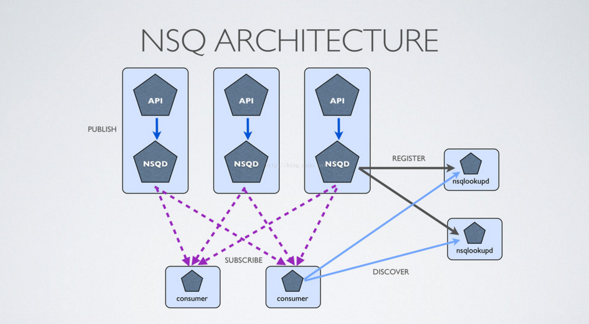
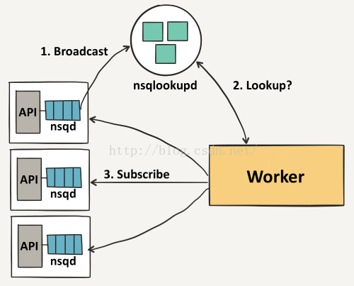

# nsq-analysis

Nsq v1.1.0 版本的源码分析

## 简介

Nsq 是 Go 语言编写的，开源的分布式消息队列中间件，可用于大规模系统中的实时消息服务，每天能够处理数亿级别的消息，其设计目标是为在分布式环境下运行的去中心化服务提供一个强大的基础架构。

Nsq 非常容易配置和部署，具有极大的灵活性，支持众多消息协议。

## Features

* Nsq 提供了分布式的，去中心化，没有单点故障的拓扑结构，保障了消息的稳定传输，够具有高容错和HA（高可用）特性。
* Nsq 支持水平扩展，没有中心化的 brokers，内置的发现服务使得在集群中增加节点非常方便，同时支持 pub-sub 和 load-balanced 的消息分发。
* Nsq 非常容易配置和部署，nsqadmin 自带一个管理界面。
* 官方的 Go 和 Python 库都有提供, 而且为大多数语言提供了库。

## 组件

* nsqlookupd

    nsqlookupd 是守护进程负责管理拓扑信息，客户端通过查询 nsqlookupd 来发现指定话题（topic）的生产。nsqlookupd 提供两个 server，tcp server 用来接收 nsqd 的广播消息，http server 用来发现和管理。

* nsqd

    nsqd 是一个守护进程，负责接收、排队、投递消息给客户端。它可以独立运行，不过通常它是由 nsqlookupd 实例所在集群配置的（它在这能声明 topics 和 channels，以便大家能找到）。    

* nsqadmin

    nsqadmin 是一套 WEB UI，用来汇集集群的实时统计，并执行不同的管理任务。

## 拓扑结构
	
Nsq 推荐通过他们相应的 nsqd 实例使用协同定位发布者，这意味着即使面对网络分区，消息也会被保存在本地，直到它们被一个消费者读取。更重要的是，发布者不必去发现其他的 nsqd 节点，他们总是可以向本地实例发布消息。

首先，一个 producer 向 nsqd节点 发送消息，要做到这点，首先要先打开一个连接（tcp/http），然后发送一个包含 topic 和消息主体的发布命令，topic 会将消息存储在内存的 memoryMsgQueue（优先）或者 磁盘上（backendQueue），通过 messagePump，topic 会复制这些消息并且 put 到在每一个连接 topic 的 channel 上。

每个 channel 的消息都会进行排队，直到一个 consumer 把他们消费，如果此队列超出了内存限制，消息将会被写入到磁盘中。nsqd 节点首先会向 nsqlookupd 广播他们的位置信息，一旦它们注册成功，consumer 将会从nsqlookupd 服务器节点上发现所有包含事件 topic 的 nsqd 节点。

然后每个 consumer 向每个 nsqd 主机进行订阅操作，用于表明 consumer 已经准备好接受消息了。

## 缺点

* nsq 内部的消息不是持久化的，因为 topic 和 channel 都使用了 memoryMsgQueue，因为当机器 down 掉之后，是无法恢复内存中的消息的

* 一条消息可能不止被发送一次，这种情况很容易发送，当一条 inFlight 的消息在 timeout 之后返回 FIN，这个时候该条消息已经被重新发送了，同理，message 的 group commit 也很容易导致这种情况，如果 consumer 要求绝对 unique，需要自行解决

* 消费者接收到消息可能是无序的，因为 topic 和 channel 都使用了 backendQueue，而 messagePump 的时候是一同 select race 的，因此可能会导致 message un-ordered

在本项目中有对源码的详细注释，nsqd 和 nsqlookupd 的详细介绍见子目录的 `readme.md`
